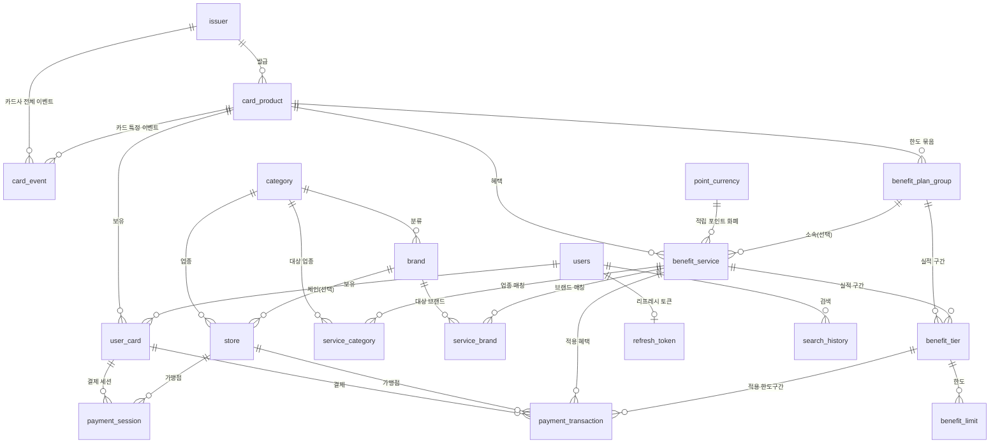

# DB 스키마 설명서

> 팀 공유용 스키마 가이드. 실행 정본은 [`docker/mysql/init/002-schema.sql`](../docker/mysql/init/002-schema.sql)이며, 이 문서는 그 구조를 표로 정리한 것입니다.
> 예시 데이터는 [`docker/mysql/init/003-seed.sql`](../docker/mysql/init/003-seed.sql)에 있고, 두 파일 모두 컨테이너 최초 기동 시 자동 적용됩니다.
>
> - **엔진/문자셋**: InnoDB / `utf8mb4` (테이블 콜레이션 `utf8mb4_0900_ai_ci`, MySQL 8.0+)
> - **테이블 수**: 19개
> - 모든 테이블은 `created_at` / `updated_at`(자동 갱신)을 공통으로 가지며, 아래 컬럼 표에서는 생략합니다.

---

## 1. 테이블 지도

| 덩어리 | 테이블 |
|---|---|
| **카드 마스터** | `issuer`, `card_product` |
| **카드 혜택 · 이벤트** | `point_currency`, `benefit_plan_group`, `benefit_service`, `benefit_tier`, `benefit_limit`, `service_brand`, `service_category`, `card_event` |
| **가맹점 분류** | `category`, `brand`, `store` |
| **사용자** | `users`, `refresh_token`, `user_card`, `search_history` |
| **결제** | `payment_transaction`, `payment_session` |

---

## 2. 관계도 (ERD)

---

## 3. 테이블별 상세

### 3.1 카드 마스터

#### `issuer` — 카드사
| 컬럼 | 타입 | 설명 |
|---|---|---|
| `issuer_id` (PK) | BIGINT | |
| `card_company_name` | VARCHAR(100) | 카드사명 (UNIQUE) |

#### `card_product` — 카드 상품
| 컬럼 | 타입 | 설명 |
|---|---|---|
| `card_product_id` (PK) | BIGINT | |
| `issuer_id` (FK) | BIGINT | → `issuer` |
| `card_name` | VARCHAR(100) | 카드명 |
| `card_type` | VARCHAR(20) | **`CREDIT`(신용) / `DEBIT`(체크)** |
| `card_image_url` | VARCHAR(500) | 카드 이미지 (NULL 허용) |

---

### 3.2 카드 혜택 · 이벤트

> 혜택 하나(`benefit_service`)는 "무엇을(적립/캐시백), 얼마(정액/정률), 어디서(브랜드/업종), 어떤 전월실적 구간에서" 주는지를 정의하고, **한도**는 전월실적 구간(`benefit_tier`)별로 `benefit_limit`에 담깁니다.

#### `point_currency` — 적립 포인트 화폐
적립(ACCUMULATE) 혜택이 쌓는 포인트와 원화 환산율.

| 컬럼 | 타입 | 설명 |
|---|---|---|
| `point_currency_id` (PK) | BIGINT | |
| `currency_name` | VARCHAR(50) | UNIQUE |
| `krw_per_point` | DECIMAL(10,4) | 1포인트 = ?원 |

#### `benefit_plan_group` — 한도 묶음
여러 혜택이 하나의 통합 한도를 공유할 때 묶는 단위.

| 컬럼 | 타입 | 설명 |
|---|---|---|
| `plan_group_id` (PK) | BIGINT | |
| `card_product_id` (FK) | BIGINT | → `card_product` |
| `group_name` | VARCHAR(100) | |

#### `benefit_service` — 혜택 본체
| 컬럼 | 타입 | 설명 |
|---|---|---|
| `service_id` (PK) | BIGINT | |
| `card_product_id` (FK) | BIGINT | → `card_product` |
| `plan_group_id` (FK, NULL) | BIGINT | → `benefit_plan_group`. 통합한도에 속하면 채움 |
| `benefit_name` | VARCHAR(100) | 혜택명 |
| `benefit_type` | VARCHAR(20) | **`ACCUMULATE`(적립) / `CASHBACK`(캐시백/할인)** |
| `value_type` | VARCHAR(10) | **`FIXED`(정액) / `RATE`(정률=%)** |
| `value_number` | DECIMAL(15,2) | 값. RATE면 %, FIXED면 원/포인트 |
| `scope_type` | VARCHAR(20) | **`BRAND` / `INDUSTRY`** (매칭 대상 구분) |
| `min_payment_amount` | DECIMAL(15,2) | 전월실적 구간 하한 (조건 없으면 0) |
| `max_payment_amount` | DECIMAL(15,2) | 전월실적 구간 상한(exclusive). NULL=상한 없음 |
| `per_tx_limit_amount` | DECIMAL(15,2) | 건당 최대 혜택액(캡). NULL 허용 |
| `point_currency_id` (FK, NULL) | BIGINT | → `point_currency`. 적립이면 필수, 캐시백이면 NULL |

#### `benefit_tier` — 전월실적 구간
`plan_group` 또는 `service` 중 **정확히 하나**에 붙습니다(XOR).

| 컬럼 | 타입 | 설명 |
|---|---|---|
| `tier_id` (PK) | BIGINT | |
| `plan_group_id` (FK, NULL) | BIGINT | → `benefit_plan_group` ⎫ 둘 중 하나만 |
| `service_id` (FK, NULL) | BIGINT | → `benefit_service` ⎭ (`ck_benefit_tier_xor`) |
| `tier_order` | INT | 구간 순서 |
| `min_prev_month_spend` | DECIMAL(15,2) | 전월실적 하한 |
| `max_prev_month_spend` | DECIMAL(15,2) | 전월실적 상한 (NULL=최상위 구간) |

#### `benefit_limit` — 실제 한도값
| 컬럼 | 타입 | 설명 |
|---|---|---|
| `limit_id` (PK) | BIGINT | |
| `tier_id` (FK) | BIGINT | → `benefit_tier` |
| `limit_basis` | VARCHAR(10) | **`AMOUNT`(원화) / `POINT`(포인트 개수) / `COUNT`(횟수)** |
| `limit_period` | VARCHAR(20) | **`PER_TRANSACTION` / `DAY` / `MONTH` / `YEAR`** |
| `limit_value` | DECIMAL(15,2) | 한도값 |

> UNIQUE `(tier_id, limit_basis, limit_period)` — 같은 tier에 같은 종류의 한도 중복 방지.

#### `service_brand` / `service_category` — 혜택 매칭 대상 (M:N)
혜택이 어느 브랜드/업종에 걸리는지를 나열하는 매핑 테이블.

- `service_brand`: `(service_id, brand_id)` — `scope_type=BRAND`일 때 사용
- `service_category`: `(service_id, category_id)` — `scope_type=INDUSTRY`일 때 사용

#### `card_event` — 이벤트(한시적 프로모션)
대상은 특정 카드 XOR 카드사 전체.

| 컬럼 | 타입 | 설명 |
|---|---|---|
| `event_id` (PK) | BIGINT | |
| `card_product_id` (FK, NULL) | BIGINT | 특정 카드 ⎫ 둘 중 하나만 |
| `issuer_id` (FK, NULL) | BIGINT | 카드사 전체 ⎭ (`ck_card_event_target_xor`) |
| `summary` | VARCHAR(255) | 한 줄 요약 |
| `starts_at` / `ends_at` | DATE | 기간 (`ends_at >= starts_at`) |
| `detail_url` | VARCHAR(500) | 자세히보기 링크 |

---

### 3.3 가맹점 분류

#### `category` — 업종
| 컬럼 | 타입 | 설명 |
|---|---|---|
| `category_id` (PK) | BIGINT | |
| `category_name` | VARCHAR(50) | UNIQUE |
| `category_image_url` | VARCHAR(500) | NULL 허용 |

#### `brand` — 체인/브랜드
| 컬럼 | 타입 | 설명 |
|---|---|---|
| `brand_id` (PK) | BIGINT | |
| `brand_name` | VARCHAR(100) | UNIQUE |
| `category_id` (FK) | BIGINT | → `category` (이 브랜드의 업종) |
| `brand_image_url` | VARCHAR(500) | NULL 허용 |

#### `store` — 실제 오프라인 매장
| 컬럼 | 타입 | 설명 |
|---|---|---|
| `store_id` (PK) | BIGINT | |
| `category_id` (FK, **NOT NULL**) | BIGINT | → `category`. 모든 매장이 반드시 가짐 |
| `brand_id` (FK, NULL) | BIGINT | → `brand`. 체인 매장만 (있으면 `brand.category_id == store.category_id`) |
| `store_name` | VARCHAR(100) | |
| `latitude` / `longitude` | DECIMAL(10,8)/(11,8) | 좌표 (거리 계산·거리순 정렬) |
| `address` | VARCHAR(255) | 도로명 주소 |
| `kakao_place_id` | VARCHAR(50) | 카카오 장소 ID (UNIQUE) |
| `store_qr_token` | VARCHAR(64) | QR 결제용 고유 문자열 (UNIQUE) |
| `store_rank` | INT | 정렬 순위 (NULL 허용) |

---

### 3.4 사용자

#### `users` — 회원
직접가입(login_id+password)과 소셜(provider_user_id) 둘 다 지원 → 로그인 식별자 컬럼들이 NULL 허용.

| 컬럼 | 타입 | 설명 |
|---|---|---|
| `user_id` (PK) | BIGINT | |
| `login_id` | VARCHAR(255) | 직접가입 ID (UNIQUE, NULL) |
| `name` | VARCHAR(50) | |
| `phone` | VARCHAR(20) | 휴대폰 (NULL) |
| `password_hash` | VARCHAR(255) | 직접가입 비번 해시 (NULL) |
| `provider_user_id` | VARCHAR(100) | 소셜 회원번호 (UNIQUE, NULL) |
| `payment_pin_hash` | VARCHAR(255) | 결제 PIN 해시 |
| `is_location_agreed` | TINYINT(1) | 위치정보 동의 |
| `is_marketing_agreed` | TINYINT(1) | 마케팅 수신 동의(선택 약관) |
| `qr_auth_id` | VARCHAR(64) | QR 인증 식별자 (NULL) |
| `auth_expires_at` | DATETIME | 인증 만료 시각 (NULL) |
| `auth_is_used` | TINYINT(1) | 인증 사용 여부 (기본 0) |
| `pin_fail_count` | INT | 결제 PIN 연속 실패 횟수 (기본 0) |

#### `refresh_token` — 리프레시 토큰
`users`에서 분리한 전용 테이블. 유저당 활성 토큰은 최대 1개(재로그인 시 갱신)라 `user_id`가 UNIQUE.

| 컬럼 | 타입 | 설명 |
|---|---|---|
| `refresh_token_id` (PK) | BIGINT | |
| `user_id` (FK, UNIQUE) | BIGINT | → `users`. 유저당 활성 토큰 1개 |
| `token_hash` | CHAR(64) | 발급된 리프레시 토큰의 해시 |

#### `user_card` — 보유 카드
카드번호는 앞4/뒤4로 분리 저장. 은행 계좌 정보는 이 테이블에 포함.

| 컬럼 | 타입 | 설명 |
|---|---|---|
| `user_card_id` (PK) | BIGINT | |
| `user_id` (FK) | BIGINT | → `users` |
| `card_product_id` (FK) | BIGINT | → `card_product` |
| `first4` / `last4` | CHAR(4) | 카드번호 앞4/뒤4 |
| `expiry_date` | DATE | 유효기간 |
| `display_order` | INT | 화면 정렬 순서 |
| `bank_name`, `balance` | VARCHAR/DECIMAL | **체크카드(DEBIT) 전용** (balance=모의결제용 잔액) |
| `credit_limit`, `scheduled_payment_amount` | DECIMAL | **신용카드(CREDIT) 전용** |
| `is_deleted` | TINYINT(1) | 소프트 삭제 (조회는 항상 `is_deleted=0`) |

> UNIQUE `(user_id, card_product_id)` — 같은 카드 중복 등록 방지.

#### `search_history` — 검색 기록
| 컬럼 | 타입 | 설명 |
|---|---|---|
| `search_history_id` (PK) | BIGINT | 최근 검색어 개별 삭제용 식별자 |
| `user_id` (FK) | BIGINT | → `users` |
| `keyword` | VARCHAR(100) | 검색창에 직접 입력한 상호명. 카테고리 탭 조회는 기록하지 않는다 |
| `searched_at` | DATETIME | 마지막으로 검색한 시각 (최근 검색어 정렬 근거) |

> **불변식은 하나다 — `(user_id, keyword)` 유일.** 같은 키워드를 재검색하면 행을 추가하지 않고
> `searched_at`만 갱신한다. 따라서 **행 수 = 그 사용자가 검색한 서로 다른 키워드 개수**이고
> 상한이 없다. v24부터 **DB가 보장한다** — `UNIQUE (user_id, keyword)`
> (`uk_search_history_user_id_keyword`, 인덱스 키 408바이트로 InnoDB 상한 3072바이트 안).
> 애플리케이션의 `INSERT … ON DUPLICATE KEY UPDATE searched_at = NOW()` 한 문장이 이 제약에
> 얹혀 원자적으로 동작하므로, "UPDATE 후 0행이면 INSERT" 분기와 그 경쟁 조건이 없다.
>
> 인덱스는 이 UNIQUE 키 하나뿐이다. v24에서 `idx_search_history_user_id`를 지웠다 —
> UNIQUE 키의 좌측 프리픽스가 `user_id`라 `WHERE user_id = ?` 조회를 그대로 커버해 중복이었다.
> `recent`(`WHERE user_id = ? ORDER BY searched_at DESC LIMIT 5`)에는 `searched_at` filesort가
> 붙지만, 행 수가 사용자당 검색 키워드 수(수십~수백)라 비용이 무의미해 `(user_id, searched_at)`
> 인덱스를 두지 않았다. **한 사용자의 행이 수천 단위로 늘면 그때 추가한다.**
>
> **검색어는 삭제하지 않고 전부 보관한다.** LOCATION-003의 "최대 5개"는 저장 한도가 아니라
> **화면 표시 개수**다. `GET /api/store/keywords`의 `recent`가 `searched_at` 내림차순 5개만
> 내려준다. 저장 한도로 두면 오래된 인기 검색어가 누군가의 6번째 검색에 밀려 삭제되면서
> 인기 검색어 집계에서 빠지는 문제가 생겨 표시 개수로 바꿨다.
>
> 사용자가 직접 지우는 경로는 `DELETE /api/store/keywords/recent/{searchHistoryId}`(개별)와
> `DELETE /api/store/keywords/recent`(전체) 두 개다. 하드 삭제이고 소프트 삭제 컬럼은 없다.
>
> `keyword` 콜레이션이 `utf8mb4_0900_ai_ci`(대소문자·악센트 무시)라 `CU`와 `cu`는 같은 키워드로
> 취급된다. 재검색 시 기존 항목이 갱신되고 칩이 둘로 갈라지지 않으므로 의도된 동작이다.
>
> 「검색어 조회(최근·인기)」의 인기 검색어가 `COUNT(*)`를 "검색 횟수"가 아니라 "그 키워드를 검색한
> 사용자 수"로 세는 이유가 이 유일 불변식이다. 한 사람이 반복 검색해 순위를 올릴 수 없다(1인 1표).

---

### 3.5 결제

#### `payment_transaction` — 결제 내역
적용 혜택과 놓친 혜택을 한 행에 인라인으로 보관.

| 컬럼 | 타입 | 설명 |
|---|---|---|
| `payment_transaction_id` (PK) | BIGINT | |
| `user_card_id` (FK) | BIGINT | → `user_card` |
| `store_id` (FK, NULL) | BIGINT | → `store` |
| `amount` | DECIMAL(15,2) | 결제액 |
| `discount_amount` | DECIMAL(15,2) | 적용된 혜택값(할인+적립 원환산) |
| `final_amount` | DECIMAL(15,2) | 최종금액 (= amount − discount_amount) |
| `paid_at` | DATETIME | 실제 승인 시각 |
| `is_used_app` / `is_eligible` | TINYINT(1) | 앱 사용 여부 / 혜택 대상 여부 |
| `applied_benefit_service_id` (FK) | BIGINT | 적용된 혜택. 혜택 0이면 NULL |
| `applied_tier_id` (FK) | BIGINT | 적용 혜택의 한도구간 (한도 소진 집계 키) |
| `better_user_card_id` (FK) | BIGINT | 놓친 혜택: 더 유리했던 보유 카드 |
| `alternative_discount_amount` | DECIMAL(15,2) | 그 카드였다면 받았을 혜택값 |
| `missed_amount` | DECIMAL(15,2) | 놓친 금액(= alternative − discount) |

#### `payment_session` — 결제 세션
QR 등으로 특정 가맹점에서 결제를 진행하는 동안의 세션 상태.

| 컬럼 | 타입 | 설명 |
|---|---|---|
| `payment_session_id` (PK) | BIGINT | |
| `user_card_id` (FK) | BIGINT | → `user_card` |
| `store_id` (FK, NULL) | BIGINT | → `store`. QR 스캔 전 가맹점 미확정 세션은 NULL |
| `session_token` | VARCHAR(64) | UNIQUE |
| `amount` | DECIMAL(12,2) | 결제 예정액 (NULL 허용) |
| `status` | VARCHAR(20) | **`PENDING`→`SCANNED`→`PROCESSING`→`COMPLETED`, 그 외 `EXPIRED`/`FAILED`** |
| `expires_at` | DATETIME | 만료 시각 |

---

## 4. 코드 값 (CHECK 제약)

| 테이블.컬럼 | 허용 값 |
|---|---|
| `card_product.card_type` | `CREDIT`, `DEBIT` |
| `benefit_service.benefit_type` | `ACCUMULATE`, `CASHBACK` |
| `benefit_service.value_type` | `FIXED`, `RATE` |
| `benefit_service.scope_type` | `BRAND`, `INDUSTRY` |
| `benefit_limit.limit_basis` | `COUNT`, `AMOUNT`, `POINT` |
| `benefit_limit.limit_period` | `PER_TRANSACTION`, `DAY`, `MONTH`, `YEAR` |
| `payment_session.status` | `PENDING`, `SCANNED`, `PROCESSING`, `COMPLETED`, `EXPIRED`, `FAILED` |

---
*스키마 변경 시 `docker/mysql/init/002-schema.sql`과 이 문서를 함께 갱신하세요.*
