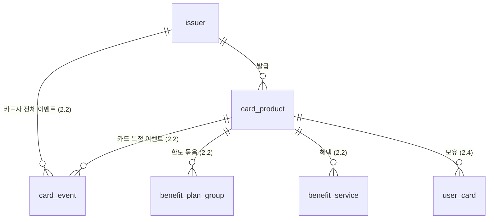
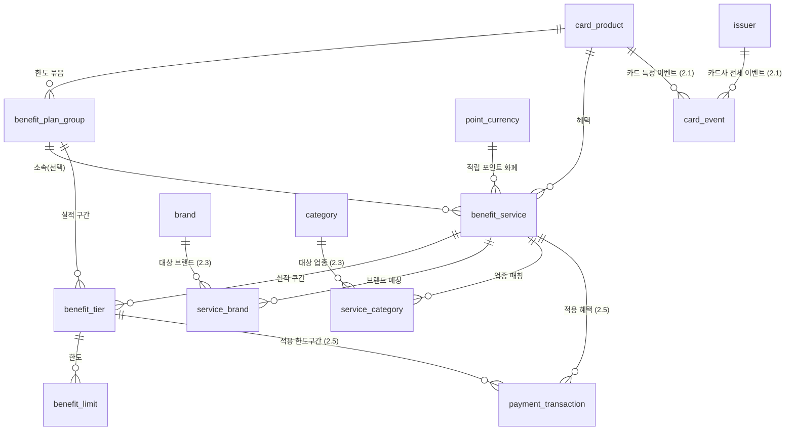
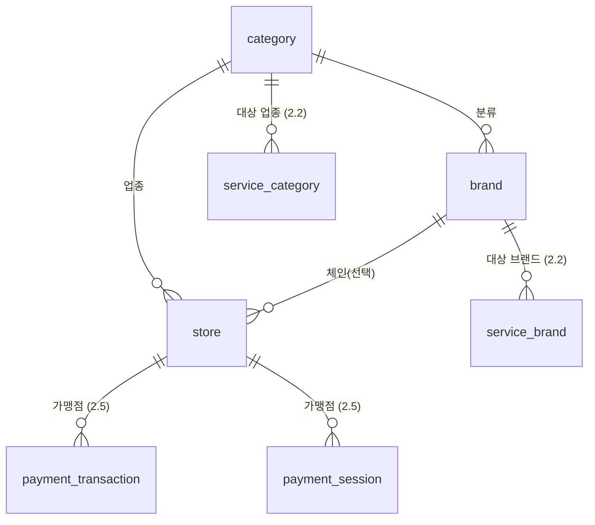
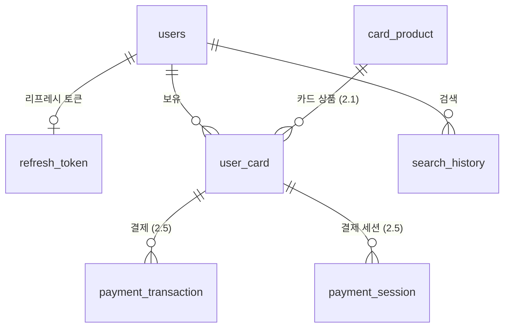
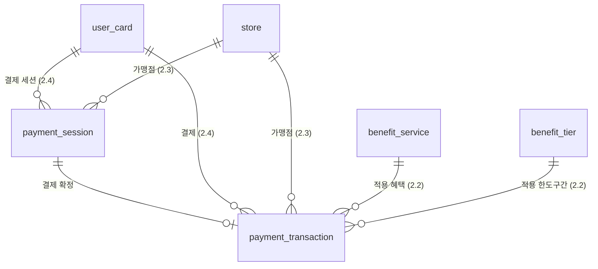

# DB 스키마 설명서

> 팀 공유용 스키마 가이드. 실행 정본은 [`src/main/resources/db/migration/`](../src/main/resources/db/migration)의 마이그레이션 파일들이며(기준 스키마는 [`V1__baseline_schema.sql`](../src/main/resources/db/migration/V1__baseline_schema.sql)), 이 문서는 그 누적 결과를 표로 정리한 것입니다.
> 참조 데이터는 [`V2__reference_data.sql`](../src/main/resources/db/migration/V2__reference_data.sql), 데모 데이터(회원·결제내역)는 [`db/seed-local/`](../src/main/resources/db/seed-local)에 있습니다. 전부 앱 기동 시 Flyway가 적용합니다 ([AGENTS.md](../AGENTS.md) §11).
>
> - **엔진/문자셋**: InnoDB / `utf8mb4` (테이블 콜레이션 `utf8mb4_0900_ai_ci`, MySQL 8.0+)
> - **테이블 수**: 19개
> - **타임존**: 컨테이너 MySQL은 KST(`+09:00`)로 고정돼 있습니다 ([AGENTS.md](../AGENTS.md) §10). `DATETIME`에 담긴 값은 전부 KST 벽시계입니다

## 표 읽는 법

모든 테이블 상세는 아래 6열로 통일돼 있습니다. **모든 컬럼을 빠짐없이 싣습니다** — 감사 컬럼(`created_at`/`updated_at`)도 생략하지 않습니다.

| 열 | 의미 |
|---|---|
| **컬럼** | 컬럼명. `(PK)` `(FK)`를 함께 표기 |
| **설명** | 한 줄 이름표 |
| **타입** | DDL 타입 그대로 |
| **NULL** | NULL 허용 여부. `YES`(허용) / `NO`(불가) 두 값만 씁니다 |
| **DEFAULT** | DDL의 `DEFAULT` 절. 없으면 `—`, PK는 `AUTO_INCREMENT` |
| **상세 설명** | FK 대상, UNIQUE·CHECK 제약, 운영 규칙 |

- 자바 매핑은 [AGENTS.md](../AGENTS.md) §9를 따릅니다 — `DECIMAL`→`BigDecimal`(필수), `TINYINT(1)`→`Boolean`, `DATE`→`LocalDate`, `DATETIME`→`LocalDateTime`
- `created_at`/`updated_at`는 **DB DEFAULT가 채우므로 INSERT/UPDATE 문에 쓰지 않습니다**. `updated_at`은 `ON UPDATE CURRENT_TIMESTAMP`로 자동 갱신됩니다
- ⚠️ **`search_history`에는 감사 컬럼이 없습니다.** 19개 중 유일한 예외로, `searched_at` 하나가 그 역할을 겸합니다

---

## 1. 테이블 지도

| 덩어리 | 테이블 | 상세 |
|---|---|---|
| **카드 마스터** | `issuer`, `card_product` | [§2.1](#21-카드-마스터) |
| **카드 혜택 · 이벤트** | `point_currency`, `benefit_plan_group`, `benefit_service`, `benefit_tier`, `benefit_limit`, `service_brand`, `service_category`, `card_event` | [§2.2](#22-카드-혜택--이벤트) |
| **가맹점 분류** | `category`, `brand`, `store` | [§2.3](#23-가맹점-분류) |
| **사용자** | `users`, `refresh_token`, `user_card`, `search_history` | [§2.4](#24-사용자) |
| **결제** | `payment_transaction`, `payment_session` | [§2.5](#25-결제) |

관계도는 이 덩어리 단위로 쪼개 각 절 머리에 뒀습니다. 덩어리를 가로지르는 관계는 양쪽 그림에 모두 그리고, 상대 절 번호를 라벨에 붙였습니다.

---

## 2. 테이블별 상세

### 2.1 카드 마스터



#### `issuer` — 카드사

| 컬럼 | 설명 | 타입 | NULL | DEFAULT | 상세 설명 |
|---|---|---|---|---|---|
| `issuer_id` (PK) | 카드사 ID | BIGINT | NO | AUTO_INCREMENT | |
| `card_company_name` | 카드사명 | VARCHAR(100) | NO | — | UNIQUE (`uk_issuer_card_company_name`) |
| `created_at` | 생성 시각 | DATETIME | NO | CURRENT_TIMESTAMP | |
| `updated_at` | 수정 시각 | DATETIME | NO | CURRENT_TIMESTAMP | `ON UPDATE CURRENT_TIMESTAMP` |

#### `card_product` — 카드 상품

| 컬럼 | 설명 | 타입 | NULL | DEFAULT | 상세 설명 |
|---|---|---|---|---|---|
| `card_product_id` (PK) | 카드 상품 ID | BIGINT | NO | AUTO_INCREMENT | |
| `issuer_id` (FK) | 카드사 | BIGINT | NO | — | → `issuer` |
| `card_name` | 카드명 | VARCHAR(100) | NO | — | |
| `card_type` | 카드 종류 | VARCHAR(20) | NO | — | CHECK `CREDIT`(신용) / `DEBIT`(체크) — [§3](#3-코드-값-check-제약) |
| `card_image_url` | 카드 이미지 경로 | VARCHAR(500) | **YES** | — | S3 경로 |
| `created_at` | 생성 시각 | DATETIME | NO | CURRENT_TIMESTAMP | |
| `updated_at` | 수정 시각 | DATETIME | NO | CURRENT_TIMESTAMP | `ON UPDATE CURRENT_TIMESTAMP` |

---

### 2.2 카드 혜택 · 이벤트

혜택 하나(`benefit_service`)는 "무엇을(적립/캐시백), 얼마(정액/정률), 어디서(브랜드/업종), 어떤 전월실적 구간에서" 주는지를 정의하고, **한도**는 전월실적 구간(`benefit_tier`)별로 `benefit_limit`에 담깁니다.



#### `point_currency` — 적립 포인트 화폐

적립(`ACCUMULATE`) 혜택이 쌓는 포인트와 원화 환산율. 카드사 하나 안에도 여러 화폐가 공존할 수 있어(예: KB 해피포인트 vs 포인트리) `benefit_service` 단위로 참조합니다.

| 컬럼 | 설명 | 타입 | NULL | DEFAULT | 상세 설명 |
|---|---|---|---|---|---|
| `point_currency_id` (PK) | 포인트 화폐 ID | BIGINT | NO | AUTO_INCREMENT | |
| `currency_name` | 화폐명 | VARCHAR(50) | NO | — | UNIQUE (`uk_point_currency_currency_name`). 예: 마이신한포인트, M포인트 |
| `krw_per_point` | 원화 환산율 | DECIMAL(10,4) | NO | — | 1포인트 = ?원. 캐시백과 혜택값을 비교하려면 필요 |
| `created_at` | 생성 시각 | DATETIME | NO | CURRENT_TIMESTAMP | |
| `updated_at` | 수정 시각 | DATETIME | NO | CURRENT_TIMESTAMP | `ON UPDATE CURRENT_TIMESTAMP` |

#### `benefit_plan_group` — 한도 묶음

여러 혜택이 하나의 통합 한도를 공유할 때 묶는 단위.

| 컬럼 | 설명 | 타입 | NULL | DEFAULT | 상세 설명 |
|---|---|---|---|---|---|
| `plan_group_id` (PK) | 한도 묶음 ID | BIGINT | NO | AUTO_INCREMENT | |
| `card_product_id` (FK) | 카드 상품 | BIGINT | NO | — | → `card_product` |
| `group_name` | 묶음 이름 | VARCHAR(100) | NO | — | |
| `created_at` | 생성 시각 | DATETIME | NO | CURRENT_TIMESTAMP | |
| `updated_at` | 수정 시각 | DATETIME | NO | CURRENT_TIMESTAMP | `ON UPDATE CURRENT_TIMESTAMP` |

> 그룹의 단위(원화/포인트)를 나타내던 `limit_unit` 컬럼은 v12에서 삭제했습니다. 소속 `benefit_limit.limit_basis`(`AMOUNT`/`POINT`)로 완전히 대체됩니다.

#### `benefit_service` — 혜택 본체

| 컬럼 | 설명 | 타입 | NULL | DEFAULT | 상세 설명 |
|---|---|---|---|---|---|
| `service_id` (PK) | 혜택 ID | BIGINT | NO | AUTO_INCREMENT | |
| `card_product_id` (FK) | 카드 상품 | BIGINT | NO | — | → `card_product` |
| `plan_group_id` (FK) | 소속 한도 묶음 | BIGINT | **YES** | — | → `benefit_plan_group`. 통합 한도에 속할 때만 채움 |
| `benefit_name` | 혜택명 | VARCHAR(100) | NO | — | |
| `benefit_type` | 혜택 종류 | VARCHAR(20) | NO | — | CHECK `ACCUMULATE`(적립) / `CASHBACK`(캐시백·할인) |
| `value_type` | 값의 형태 | VARCHAR(10) | NO | — | CHECK `FIXED`(정액) / `RATE`(정률=%) |
| `value_number` | 혜택 값 | DECIMAL(15,2) | NO | — | `RATE`면 %, `FIXED`면 원 또는 포인트 |
| `scope_type` | 매칭 대상 구분 | VARCHAR(20) | NO | — | CHECK `BRAND` / `INDUSTRY`. 어느 매핑 테이블을 보는지 결정 |
| `min_payment_amount` | **혜택값이 적용되는** 전월실적 하한 | DECIMAL(15,2) | NO | `0.00` | ⚠️ 이름은 `payment_amount`지만 **건당 결제액이 아니라 전월실적**입니다. 아래 `min_tx_amount`(건당)와 헷갈리지 마세요. **"조건 없음"을 NULL이 아니라 0으로 씁니다** — NULL은 `<=` 비교에서 UNKNOWN이 되어 조건 없는 행이 조회에서 조용히 빠집니다 (v9) |
| `max_payment_amount` | **혜택값이 적용되는** 전월실적 상한 | DECIMAL(15,2) | **YES** | — | exclusive. 구간을 반열린 `[min, max)`로 표현해 실적 P에 대해 `min<=P<max`로 정확히 한 구간이 뽑힙니다. NULL=상한 없음. CHECK `max > min` |
| `min_tx_amount` | 건당 최소 이용금액 | DECIMAL(15,2) | NO | `0.00` | **v27 신규.** 1회 결제가 이 금액 미만이면 혜택이 **아예 발생하지 않습니다**. 위 `min_payment_amount`(전월 누적)와 이름이 비슷하지만 축이 다릅니다 — 이쪽만 "이번 결제 1건"을 봅니다. 3사 약관에 실재합니다(KB "건당 1만원 이상 이용 시 적립", 신한 The More "건당 5,000원 이상 사용시 적용", 현대 ZERO Up "1건당 10만원 이상 결제건에 대해서만"). 조건 없음을 0으로 두는 것은 v9와 같은 이유 |
| `per_tx_limit_amount` | 건당 혜택 캡 | DECIMAL(15,2) | **YES** | — | 건당 최대 혜택액. NULL=캡 없음 |
| `point_currency_id` (FK) | 적립 포인트 화폐 | BIGINT | **YES** | — | → `point_currency`. CHECK로 `ACCUMULATE`면 **필수**, `CASHBACK`이면 **반드시 NULL** (`ck_benefit_service_point_currency_required`) |
| `created_at` | 생성 시각 | DATETIME | NO | CURRENT_TIMESTAMP | |
| `updated_at` | 수정 시각 | DATETIME | NO | CURRENT_TIMESTAMP | `ON UPDATE CURRENT_TIMESTAMP` |

> **카테고리 컬럼이 없습니다.** 혜택이 어느 업종에 걸리는지는 카테고리가 1개든 6개든 제한이 없든 전부 `service_category`(M:N) 행으로만 표현합니다(v7). 예전엔 `category_id` 직접 참조와 매핑 테이블 경유가 갈라져 있어 조회할 때마다 두 경로를 다 확인해야 했습니다.
>
> 구간 사이의 빈틈·겹침은 여러 행에 걸친 조건이라 CHECK로 막을 수 없습니다. **적재 시점에 보장합니다.**

#### `benefit_tier` — 전월실적 구간

`plan_group` 또는 `service` 중 **정확히 하나**에 붙습니다(XOR).

| 컬럼 | 설명 | 타입 | NULL | DEFAULT | 상세 설명 |
|---|---|---|---|---|---|
| `tier_id` (PK) | 구간 ID | BIGINT | NO | AUTO_INCREMENT | |
| `plan_group_id` (FK) | 소속 한도 묶음 | BIGINT | **YES** | — | → `benefit_plan_group`. `service_id`와 **둘 중 하나만** (`ck_benefit_tier_xor`) |
| `service_id` (FK) | 소속 혜택 | BIGINT | **YES** | — | → `benefit_service`. `plan_group_id`와 **둘 중 하나만** |
| `tier_order` | 구간 순서 | INT | NO | — | |
| `min_prev_month_spend` | **한도가 적용되는** 전월실적 하한 | DECIMAL(15,2) | NO | — | `benefit_service` 쪽 실적 구간과 헷갈리기 쉽습니다 — [아래 비교표](#전월실적-구간이-두-군데-있는-이유) 참고 |
| `max_prev_month_spend` | **한도가 적용되는** 전월실적 상한 | DECIMAL(15,2) | **YES** | — | exclusive. NULL=최상위 구간(상한 없음) |
| `created_at` | 생성 시각 | DATETIME | NO | CURRENT_TIMESTAMP | |
| `updated_at` | 수정 시각 | DATETIME | NO | CURRENT_TIMESTAMP | `ON UPDATE CURRENT_TIMESTAMP` |

> 한도값을 들고 있던 `limit_amount` 컬럼은 v13에서 삭제했습니다. 같은 `tier_id`를 참조하는 `benefit_limit.limit_value`와 완전히 중복이었습니다.

##### 전월실적 구간이 두 군데 있는 이유

`benefit_service`와 `benefit_tier` 양쪽에 전월실적 구간이 있습니다. **같은 축(전월실적 원)이지만 결정하는 대상이 다릅니다.**

| | `benefit_service.min/max_payment_amount` | `benefit_tier.min/max_prev_month_spend` |
|---|---|---|
| 결정하는 것 | **혜택값**(`value_number` 요율·정액)과 적용 자격 | **한도**(`benefit_limit.limit_value`) |
| 구간이 다르면 | **별개의 `benefit_service` 행**이 된다 | 같은 혜택 안의 다른 `benefit_tier` 행 |
| 붙는 대상 | 혜택 1건 | 혜택 1건 **또는** 통합한도 묶음(`plan_group`) |

**패턴 A — 실적이 요율을 가른다.** 혜택 행이 쪼개지고, `benefit_tier`는 `0~INF` 한 구간짜리 껍데기가 됩니다.

```
service 29  특별 적립 - 주유 (40만원 이상 구간)   2.5%   bs 400,000~1,000,000   tier 0~INF
service 30  특별 적립 - 주유 (100만원 이상 구간)  5.0%   bs 1,000,000~INF       tier 0~INF
```

**패턴 B — 실적이 한도를 가른다.** 혜택은 문턱 하나뿐이고 `benefit_tier`가 여러 구간으로 갈립니다.

```
service 44  10% 할인   RATE 10%   bs 400,000~INF
  tier1    400,000~  800,000  →  월 한도 10,000원
  tier2    800,000~1,200,000  →  월 한도 25,000원
  tier3  1,200,000~INF        →  월 한도 50,000원
```

요율은 실적과 무관하게 10% 고정이고 월 한도만 커집니다. 시드 기준 tier를 가진 혜택 111건 중 A형 73건 / B형 30건 / 기타 8건이고, 한 카드가 두 방식을 섞어 씁니다.

**따라서 조회는 유저 전월실적 P로 두 번 거릅니다** — ① `bs.min <= P < bs.max`로 혜택 후보를 뽑고, ② 그 혜택의 tier 중 `t.min <= P < t.max`인 구간에서 한도를 읽습니다.

여기서 P(전월실적)는 `payment_transaction`을 합산해 구하는데, **`is_eligible = 1`인 거래만 셉니다** — 세금·공과금·상품권처럼 카드사가 실적에서 빼는 거래가 `is_eligible = 0`입니다 ([§2.5](#25-결제)).

`plan_group`은 패턴 B의 확장입니다. 여러 혜택이 tier 집합을 공유해 한도를 합산합니다 — 예: "Making 17 서비스 통합 월적립한도"는 혜택 6건이 3구간 tier를 공유합니다.

#### `benefit_limit` — 실제 한도값

| 컬럼 | 설명 | 타입 | NULL | DEFAULT | 상세 설명 |
|---|---|---|---|---|---|
| `limit_id` (PK) | 한도 ID | BIGINT | NO | AUTO_INCREMENT | |
| `tier_id` (FK) | 대상 실적 구간 | BIGINT | NO | — | → `benefit_tier` |
| `limit_basis` | 한도 기준 | VARCHAR(10) | NO | — | CHECK `AMOUNT`(원화) / `POINT`(포인트 개수) / `COUNT`(횟수) |
| `limit_period` | 한도 주기 | VARCHAR(20) | NO | — | CHECK `PER_TRANSACTION` / `DAY` / `MONTH` / `YEAR` |
| `limit_value` | 한도값 | DECIMAL(15,2) | NO | — | 단위는 `limit_basis`가 결정 |
| `created_at` | 생성 시각 | DATETIME | NO | CURRENT_TIMESTAMP | |
| `updated_at` | 수정 시각 | DATETIME | NO | CURRENT_TIMESTAMP | `ON UPDATE CURRENT_TIMESTAMP` |

> UNIQUE `(tier_id, limit_basis, limit_period)` (`uq_benefit_limit_tier_basis_period`) — 같은 구간에 같은 종류(기준+주기)의 한도가 둘 이상 들어가는 것을 막습니다.
>
> `AMOUNT`와 `POINT`를 나눈 이유(v11): 이전엔 둘 다 `AMOUNT`로 저장돼, 같은 적립 혜택인데 한도가 "원화 환산"인지 "포인트 개수"인지 DB만 보고 구분할 수 없었습니다.

#### `service_brand` — 혜택 ↔ 브랜드 매칭 (M:N)

`scope_type = BRAND`인 혜택이 어느 브랜드에 걸리는지 나열합니다.

| 컬럼 | 설명 | 타입 | NULL | DEFAULT | 상세 설명 |
|---|---|---|---|---|---|
| `service_brand_id` (PK) | 매핑 ID | BIGINT | NO | AUTO_INCREMENT | |
| `service_id` (FK) | 혜택 | BIGINT | NO | — | → `benefit_service` |
| `brand_id` (FK) | 대상 브랜드 | BIGINT | NO | — | → `brand` |
| `created_at` | 생성 시각 | DATETIME | NO | CURRENT_TIMESTAMP | |
| `updated_at` | 수정 시각 | DATETIME | NO | CURRENT_TIMESTAMP | `ON UPDATE CURRENT_TIMESTAMP` |

> UNIQUE `(service_id, brand_id)` (`uk_service_brand_service_id_brand_id`)

#### `service_category` — 혜택 ↔ 업종 매칭 (M:N)

`scope_type = INDUSTRY`인 혜택이 어느 업종에 걸리는지 나열합니다. `service_brand`와 완전히 대칭 구조입니다.

| 컬럼 | 설명 | 타입 | NULL | DEFAULT | 상세 설명 |
|---|---|---|---|---|---|
| `service_category_id` (PK) | 매핑 ID | BIGINT | NO | AUTO_INCREMENT | |
| `service_id` (FK) | 혜택 | BIGINT | NO | — | → `benefit_service` |
| `category_id` (FK) | 대상 업종 | BIGINT | NO | — | → `category` |
| `created_at` | 생성 시각 | DATETIME | NO | CURRENT_TIMESTAMP | |
| `updated_at` | 수정 시각 | DATETIME | NO | CURRENT_TIMESTAMP | `ON UPDATE CURRENT_TIMESTAMP` |

> UNIQUE `(service_id, category_id)` (`uk_service_category_service_id_category_id`)
>
> 업종 제한이 없는 혜택(전 가맹점 대상)은 **6종 전부를 행으로 깝니다.** 카테고리가 1개든 여러 개든 없든 전부 같은 방식으로 조회하기 위해서입니다.

#### `card_event` — 이벤트(한시적 프로모션)

상시 혜택(`benefit_service`)엔 기간 컬럼이 없어 한시적 프로모션을 표현할 수 없습니다. 요약·기간·링크만 최소로 보관합니다. 대상은 특정 카드 XOR 카드사 전체입니다.

| 컬럼 | 설명 | 타입 | NULL | DEFAULT | 상세 설명 |
|---|---|---|---|---|---|
| `event_id` (PK) | 이벤트 ID | BIGINT | NO | AUTO_INCREMENT | |
| `card_product_id` (FK) | 대상 카드 | BIGINT | **YES** | — | → `card_product`. `issuer_id`와 **둘 중 하나만** (`ck_card_event_target_xor`) |
| `issuer_id` (FK) | 대상 카드사 | BIGINT | **YES** | — | → `issuer`. 카드 특정이 안 될 때 "그 카드사 모든 카드 대상"을 뜻함 |
| `summary` | 한 줄 요약 | VARCHAR(255) | NO | — | 예: "스타벅스 결제 시 10% 할인" |
| `starts_at` | 시작일 | DATE | NO | — | |
| `ends_at` | 종료일 | DATE | NO | — | CHECK `ends_at >= starts_at` (`ck_card_event_period`) |
| `detail_url` | 자세히보기 링크 | VARCHAR(500) | **YES** | — | |
| `created_at` | 생성 시각 | DATETIME | NO | CURRENT_TIMESTAMP | |
| `updated_at` | 수정 시각 | DATETIME | NO | CURRENT_TIMESTAMP | `ON UPDATE CURRENT_TIMESTAMP` |

---

### 2.3 가맹점 분류



#### `category` — 업종

| 컬럼 | 설명 | 타입 | NULL | DEFAULT | 상세 설명 |
|---|---|---|---|---|---|
| `category_id` (PK) | 업종 ID | BIGINT | NO | AUTO_INCREMENT | |
| `category_name` | 업종명 | VARCHAR(50) | NO | — | UNIQUE (`uk_category_category_name`) |
| `category_image_url` | 업종 대표 이미지 경로 | VARCHAR(500) | **YES** | — | S3 경로 |
| `created_at` | 생성 시각 | DATETIME | NO | CURRENT_TIMESTAMP | |
| `updated_at` | 수정 시각 | DATETIME | NO | CURRENT_TIMESTAMP | `ON UPDATE CURRENT_TIMESTAMP` |

#### `brand` — 체인/브랜드

| 컬럼 | 설명 | 타입 | NULL | DEFAULT | 상세 설명 |
|---|---|---|---|---|---|
| `brand_id` (PK) | 브랜드 ID | BIGINT | NO | AUTO_INCREMENT | |
| `brand_name` | 브랜드명 | VARCHAR(100) | NO | — | UNIQUE (`uk_brand_brand_name`) |
| `category_id` (FK) | 이 브랜드의 업종 | BIGINT | NO | — | → `category` |
| `brand_image_url` | 브랜드 대표 이미지 경로 | VARCHAR(500) | **YES** | — | S3 경로 |
| `created_at` | 생성 시각 | DATETIME | NO | CURRENT_TIMESTAMP | |
| `updated_at` | 수정 시각 | DATETIME | NO | CURRENT_TIMESTAMP | `ON UPDATE CURRENT_TIMESTAMP` |

#### `store` — 실제 오프라인 매장

| 컬럼 | 설명 | 타입 | NULL | DEFAULT | 상세 설명 |
|---|---|---|---|---|---|
| `store_id` (PK) | 매장 ID | BIGINT | NO | AUTO_INCREMENT | |
| `category_id` (FK) | 업종 | BIGINT | NO | — | → `category`. **모든 매장이 반드시 가집니다** |
| `brand_id` (FK) | 체인/브랜드 | BIGINT | **YES** | — | → `brand`. 스타벅스·GS25처럼 인식 가능한 체인일 때만 채움. 있으면 `brand.category_id == store.category_id` (적재 시 보장) |
| `store_name` | 매장명 | VARCHAR(100) | NO | — | |
| `store_rank` | 정렬 순위 | INT | **YES** | — | |
| `latitude` | 위도 | DECIMAL(10,8) | **YES** | — | 거리 계산·거리순 정렬의 근거. **NULL이면 거리 조회에서 빠집니다** |
| `longitude` | 경도 | DECIMAL(11,8) | **YES** | — | 위와 같음 |
| `address` | 도로명 주소 | VARCHAR(255) | **YES** | — | |
| `kakao_place_id` | 카카오 장소 ID | VARCHAR(50) | **YES** | — | UNIQUE (`uk_store_kakao_place_id`) |
| `store_qr_token` | QR 결제용 토큰 | VARCHAR(64) | **YES** | — | UNIQUE (`uk_store_qr_token`). 가맹점 QR코드에 인코딩되는 문자열 |
| `created_at` | 생성 시각 | DATETIME | NO | CURRENT_TIMESTAMP | |
| `updated_at` | 수정 시각 | DATETIME | NO | CURRENT_TIMESTAMP | `ON UPDATE CURRENT_TIMESTAMP` |

> **업종을 브랜드로 추론하지 않고 직접 참조하는 이유**(v17): 실제 오프라인 매장은 대부분 등록 브랜드에 해당하지 않습니다(동네 식당·개인 병원·로컬 카페). 예전엔 `store → brand → category`로 업종을 추론했는데, 브랜드 미상 매장은 업종조차 못 잡혀 **어떤 혜택에도 매칭되지 않았습니다.**
>
> `latitude`/`longitude`/`address`/`kakao_place_id`/`store_qr_token`은 전부 NULL 허용입니다. 좌표가 없는 매장이 존재할 수 있다는 뜻이라, 거리 기반 조회는 이를 전제해야 합니다.

---

### 2.4 사용자



#### `users` — 회원

직접가입(`login_id` + `password_hash`)과 소셜(`provider_user_id`)을 둘 다 지원합니다. **그래서 로그인 식별자 컬럼이 전부 NULL 허용입니다** — 가입 경로에 따라 한쪽만 채워집니다.

| 컬럼 | 설명 | 타입 | NULL | DEFAULT | 상세 설명 |
|---|---|---|---|---|---|
| `user_id` (PK) | 회원 ID | BIGINT | NO | AUTO_INCREMENT | |
| `login_id` | 직접가입 로그인 ID | VARCHAR(255) | **YES** | — | UNIQUE (`uk_users_login_id`). 현재는 이메일 값. 소셜 가입 유저는 NULL |
| `name` | 이름 | VARCHAR(50) | NO | — | |
| `phone` | 휴대폰 번호 | VARCHAR(20) | **YES** | — | 예: `010-0000-0000`. 미입력 가입 경로가 있어 NULL 허용 |
| `password_hash` | 로그인 비밀번호 해시 | VARCHAR(255) | **YES** | — | 직접가입 전용. 소셜 가입 유저는 비밀번호가 없어 NULL |
| `provider_user_id` | 소셜 회원번호 | VARCHAR(100) | **YES** | — | UNIQUE (`uk_users_provider_user_id`). 카카오 회원번호. 직접가입 유저는 NULL |
| `payment_pin_hash` | 결제 PIN 해시 | VARCHAR(255) | **YES** | — | PIN 미설정 상태가 있어 NULL 허용 |
| `is_location_agreed` | 위치정보 동의 여부 | TINYINT(1) | NO | `0` | 위치 기반 가맹점 기능용 |
| `is_marketing_agreed` | 마케팅 수신 동의 여부 | TINYINT(1) | NO | `0` | **[선택] 약관.** 필수 약관(서비스·개인정보)은 가입 조건이라 저장하지 않습니다 |
| `pin_auth_id` | 결제 PIN 인증 세션 ID | VARCHAR(64) | **YES** | — | QR 발급이 아니라 **PIN 인증** 세션의 식별자입니다 (v25에 `qr_auth_id`에서 rename). QR 세션 열쇠는 `payment_session.session_token` 쪽 |
| `auth_expires_at` | 인증 만료 시각 | DATETIME | **YES** | — | `pin_auth_id`와 짝 |
| `auth_is_used` | 인증 사용 여부 | TINYINT(1) | NO | `0` | `pin_auth_id`와 짝 |
| `pin_fail_count` | PIN 연속 실패 횟수 | INT | NO | `0` | 잠금 판정용. 성공 시 0으로 초기화 |
| `created_at` | 생성 시각 | DATETIME | NO | CURRENT_TIMESTAMP | |
| `updated_at` | 수정 시각 | DATETIME | NO | CURRENT_TIMESTAMP | `ON UPDATE CURRENT_TIMESTAMP` |

#### `refresh_token` — 리프레시 토큰

`users`에서 분리한 전용 테이블(v23). 유저당 활성 토큰은 최대 1개(재로그인 시 갱신)라 `user_id`가 UNIQUE입니다.

| 컬럼 | 설명 | 타입 | NULL | DEFAULT | 상세 설명 |
|---|---|---|---|---|---|
| `refresh_token_id` (PK) | 토큰 행 ID | BIGINT | NO | AUTO_INCREMENT | |
| `user_id` (FK) | 회원 | BIGINT | NO | — | → `users`. UNIQUE (`uk_refresh_token_user_id`) — 유저당 활성 토큰 1개 |
| `token_hash` | 리프레시 토큰 해시 | CHAR(64) | NO | — | 원문을 저장하지 않습니다 |
| `created_at` | 생성 시각 | DATETIME | NO | CURRENT_TIMESTAMP | |
| `updated_at` | 수정 시각 | DATETIME | NO | CURRENT_TIMESTAMP | `ON UPDATE CURRENT_TIMESTAMP` |

#### `user_card` — 보유 카드

카드번호는 앞4/뒤4로 분리 저장합니다. 은행 계좌 정보는 별도 테이블 없이 이 테이블에 흡수돼 있습니다(v16, 비정규화).

| 컬럼 | 설명 | 타입 | NULL | DEFAULT | 상세 설명 |
|---|---|---|---|---|---|
| `user_card_id` (PK) | 보유 카드 ID | BIGINT | NO | AUTO_INCREMENT | |
| `user_id` (FK) | 회원 | BIGINT | NO | — | → `users` |
| `card_product_id` (FK) | 카드 상품 | BIGINT | NO | — | → `card_product` |
| `first4` | 카드번호 앞 4자리 | CHAR(4) | NO | — | |
| `last4` | 카드번호 뒤 4자리 | CHAR(4) | NO | — | |
| `expiry_date` | 유효기간 | DATE | NO | — | |
| `display_order` | 화면 정렬 순서 | INT | NO | — | |
| `bank_name` | 결제 은행명 | VARCHAR(50) | **YES** | — | **체크카드(`DEBIT`) 전용** |
| `balance` | 계좌 잔액 | DECIMAL(15,2) | **YES** | — | **체크카드(`DEBIT`) 전용.** 로컬 앱 결제가 완료되면 해당 거래의 `final_amount`만큼 차감되는 모의결제용 잔액 |
| `credit_limit` | 신용 한도 | DECIMAL(15,2) | **YES** | — | **신용카드(`CREDIT`) 전용** |
| `scheduled_payment_amount` | 결제 예정 금액 | DECIMAL(15,2) | **YES** | — | **신용카드(`CREDIT`) 전용** |
| `created_at` | 생성 시각 | DATETIME | NO | CURRENT_TIMESTAMP | |
| `updated_at` | 수정 시각 | DATETIME | NO | CURRENT_TIMESTAMP | `ON UPDATE CURRENT_TIMESTAMP` |
| `is_deleted` | 소프트 삭제 여부 | TINYINT(1) | NO | `0` | **조회는 항상 `is_deleted = 0`** ([AGENTS.md](../AGENTS.md) §9) |

> UNIQUE `(user_id, card_product_id)` (`uk_user_card_user_id_card_product_id`) — 같은 카드 중복 등록 방지.
>
> **물리 DELETE를 쓰지 않습니다**(v20). `payment_transaction`이 `user_card`를 FK 참조해 결제 이력이 깨지기 때문입니다. 삭제는 `is_deleted = 1`, 같은 카드 재등록은 새 행 INSERT가 아니라 **삭제행을 되살리는 재활성화**입니다 — 그래야 위 UNIQUE 제약이 그대로 유지됩니다.
>
> 컬럼 순서상 `is_deleted`가 감사 컬럼 뒤에 옵니다(v20에서 뒤에 추가). DDL 순서를 그대로 반영한 것입니다.

#### `search_history` — 검색 기록

⚠️ **19개 테이블 중 유일하게 `created_at`/`updated_at`가 없습니다.** `searched_at` 하나가 그 역할을 겸합니다.

| 컬럼 | 설명 | 타입 | NULL | DEFAULT | 상세 설명 |
|---|---|---|---|---|---|
| `search_history_id` (PK) | 검색 기록 ID | BIGINT | NO | AUTO_INCREMENT | 최근 검색어 **개별 삭제**용 식별자 |
| `user_id` (FK) | 회원 | BIGINT | NO | — | → `users`. UNIQUE 키의 좌측 프리픽스 |
| `keyword` | 검색어 | VARCHAR(100) | NO | — | 검색창에 직접 입력한 상호명. 카테고리 탭 조회는 기록하지 않습니다 |
| `searched_at` | 마지막 검색 시각 | DATETIME | NO | — | **DEFAULT가 없어 애플리케이션이 `NOW()`로 씁니다.** 최근 검색어 정렬 근거 |

> **불변식은 하나다 — `(user_id, keyword)` 유일.** 같은 키워드를 재검색하면 행을 추가하지 않고 `searched_at`만 갱신합니다. 따라서 **행 수 = 그 사용자가 검색한 서로 다른 키워드 개수**이고 상한이 없습니다. v24부터 **DB가 보장합니다** — `UNIQUE (user_id, keyword)` (`uk_search_history_user_id_keyword`, 인덱스 키 408바이트로 InnoDB 상한 3072바이트 안).
> 애플리케이션의 `INSERT … ON DUPLICATE KEY UPDATE searched_at = NOW()` 한 문장이 이 제약에 얹혀 원자적으로 동작하므로, "UPDATE 후 0행이면 INSERT" 분기와 그 경쟁 조건이 없습니다.
>
> 인덱스는 이 UNIQUE 키 하나뿐입니다. v24에서 `idx_search_history_user_id`를 지웠습니다 — UNIQUE 키의 좌측 프리픽스가 `user_id`라 `WHERE user_id = ?` 조회를 그대로 커버해 중복이었습니다.
> `recent`(`WHERE user_id = ? ORDER BY searched_at DESC LIMIT 5`)에는 `searched_at` filesort가 붙지만, 행 수가 사용자당 검색 키워드 수(수십~수백)라 비용이 무의미해 `(user_id, searched_at)` 인덱스를 두지 않았습니다. **한 사용자의 행이 수천 단위로 늘면 그때 추가합니다.**
>
> **검색어는 삭제하지 않고 전부 보관합니다.** LOCATION-003의 "최대 5개"는 저장 한도가 아니라 **화면 표시 개수**입니다. `GET /api/store/keywords`의 `recent`가 `searched_at` 내림차순 5개만 내려줍니다. 저장 한도로 두면 오래된 인기 검색어가 누군가의 6번째 검색에 밀려 삭제되면서 인기 검색어 집계에서 빠지는 문제가 생겨 표시 개수로 바꿨습니다.
>
> 사용자가 직접 지우는 경로는 `DELETE /api/store/keywords/recent/{searchHistoryId}`(개별)와 `DELETE /api/store/keywords/recent`(전체) 두 개입니다. 하드 삭제이고 소프트 삭제 컬럼은 없습니다.
>
> `keyword` 콜레이션이 `utf8mb4_0900_ai_ci`(대소문자·악센트 무시)라 `CU`와 `cu`는 같은 키워드로 취급됩니다. 재검색 시 기존 항목이 갱신되고 칩이 둘로 갈라지지 않으므로 의도된 동작입니다.
>
> 「검색어 조회(최근·인기)」의 인기 검색어가 `COUNT(*)`를 "검색 횟수"가 아니라 "그 키워드를 검색한 사용자 수"로 세는 이유가 이 유일 불변식입니다. 한 사람이 반복 검색해 순위를 올릴 수 없습니다(1인 1표).

---

### 2.5 결제



`payment_transaction`은 `user_card`를 **두 번** 참조합니다 — 실제 결제에 쓴 카드(`user_card_id`)와 놓친 혜택 계산에서 더 유리했던 카드(`better_user_card_id`).

#### `payment_session` — 결제 세션

QR 등으로 특정 가맹점에서 결제를 진행하는 동안의 세션 상태.

| 컬럼 | 설명 | 타입 | NULL | DEFAULT | 상세 설명 |
|---|---|---|---|---|---|
| `payment_session_id` (PK) | 세션 ID | BIGINT | NO | AUTO_INCREMENT | |
| `user_card_id` (FK) | 결제 카드 | BIGINT | NO | — | → `user_card` |
| `store_id` (FK) | 가맹점 | BIGINT | **YES** | — | → `store`. **QR 스캔 전 가맹점 미확정 세션은 NULL** |
| `session_token` | 세션 열쇠 | VARCHAR(64) | NO | — | UNIQUE (`uk_payment_session_token`). QR 생성(세션 시작) 시점 발급 |
| `payment_id` | 결제 건 식별자 | VARCHAR(64) | **YES** | — | UNIQUE (`uk_payment_session_payment_id`). 가맹점이 QR을 스캔하는 시점 발급 |
| `amount` | 결제 예정액 | DECIMAL(12,2) | **YES** | — | 금액 미확정 단계가 있어 NULL 허용 |
| `status` | 세션 상태 | VARCHAR(20) | NO | — | CHECK `PENDING`→`SCANNED`→`PROCESSING`→`COMPLETED`, 그 외 `EXPIRED`/`FAILED` |
| `fail_reason` | 실패 사유 | VARCHAR(50) | **YES** | — | CHECK. **`status = FAILED`일 때만 채웁니다** |
| `expires_at` | 만료 시각 | DATETIME | NO | — | |
| `created_at` | 생성 시각 | DATETIME | NO | CURRENT_TIMESTAMP | |
| `updated_at` | 수정 시각 | DATETIME | NO | CURRENT_TIMESTAMP | `ON UPDATE CURRENT_TIMESTAMP` |

> **식별자가 두 개인 이유 — 발급 시점이 다르다.**
>
> | | `session_token` | `payment_id` |
> |---|---|---|
> | 발급 시점 | QR 생성 (세션 시작) | 가맹점이 QR을 스캔 |
> | 정체 | 세션 자체의 열쇠 | 그 결제 건의 식별자 |
> | NULL | 불가 (`NOT NULL`) | 스캔 전에는 NULL |
>
> 스캔 이후의 결제 요청들은 `payment_id`로 세션을 조회합니다. 따라서 `PENDING` 세션과 스캔 전에 만료된 `EXPIRED` 세션은 `payment_id`가 NULL입니다. UNIQUE가 걸려 있지만 MySQL은 NULL을 중복 허용하므로 그런 세션이 여럿 있어도 충돌하지 않습니다.
>
> **`fail_reason`은 `status = 'FAILED'`일 때만 채웁니다.** 만료는 `status = 'EXPIRED'`가 이미 표현하므로 값 집합([§3](#3-코드-값-check-제약))에 넣지 않았습니다 — 넣으면 `status`와 `fail_reason`이 서로 어긋난 상태가 표현 가능해집니다. `status`와 마찬가지로 CHECK 제약으로 값을 고정해, 자유 텍스트가 섞여 실패 유형 집계가 깨지는 것을 막습니다.
>
> 세션이 승인으로 끝나면 `payment_transaction` 행이 생기고 그쪽 `payment_session_id`가 이 세션을 가리킵니다. 실패·만료 세션에는 대응하는 거래가 없습니다.

#### `payment_transaction` — 결제 내역

적용 혜택과 놓친 혜택을 한 행에 인라인으로 보관합니다.

| 컬럼 | 설명 | 타입 | NULL | DEFAULT | 상세 설명 |
|---|---|---|---|---|---|
| `payment_transaction_id` (PK) | 결제 내역 ID | BIGINT | NO | AUTO_INCREMENT | |
| `user_card_id` (FK) | 결제에 쓴 카드 | BIGINT | NO | — | → `user_card` |
| `store_id` (FK) | 가맹점 | BIGINT | **YES** | — | → `store`. 가맹점을 특정 못한 거래는 NULL |
| `payment_session_id` (FK) | 확정된 결제 세션 | BIGINT | **YES** | — | → `payment_session`. UNIQUE (`uk_pt_payment_session_id`). **앱을 거치지 않은 거래는 NULL** |
| `amount` | 결제액 | DECIMAL(15,2) | NO | — | **원화** |
| `discount_amount` | 적용된 혜택값 | DECIMAL(15,2) | NO | `0.00` | ⚠️ **네이티브 단위입니다** — `applied_benefit_service_id`의 `benefit_type`으로 해석합니다(`CASHBACK`=원, `ACCUMULATE`=포인트 **개수**). 어떤 포인트인지는 `benefit_service.point_currency_id`로 판별하고, 원화가 필요한 집계는 `point_currency.krw_per_point`를 곱합니다. 아래 인용 블록 참고 |
| `final_amount` | 최종 결제 금액 | DECIMAL(15,2) | NO | — | **원화.** ⚠️ `amount` − `discount_amount`가 **아닙니다** — 혜택값을 원화로 환산한 뒤 뺀 값입니다 |
| `paid_at` | 실제 승인 시각 | DATETIME | NO | — | **비즈니스 시각.** 레코드 생성 시각(`created_at`)과 분리 |
| `transaction_status` | 거래 상태 | VARCHAR(20) | NO | `APPROVED` | CHECK `APPROVED`(승인) / `CANCELED`(전체 승인취소). 취소 시각은 별도로 저장하지 않습니다 — [§3](#3-코드-값-check-제약) |
| `is_used_app` | 앱 사용 여부 | TINYINT(1) | NO | `0` | 앱(QR)을 거친 결제인지. 앱을 거쳤으면 `payment_session_id`도 채워집니다 |
| `is_eligible` | **전월실적 산정 대상 여부** | TINYINT(1) | NO | `1` | `0`이면 이 거래가 **전월실적 합계에서 빠집니다**(세금·공과금·상품권 등 카드사가 실적에서 제외하는 거래). ⚠️ **스키마 전체에서 기본값이 `1`인 유일한 컬럼** — 대부분의 거래는 실적에 포함되기 때문입니다 |
| `applied_benefit_service_id` (FK) | 적용된 혜택 | BIGINT | **YES** | — | → `benefit_service`. 받은 혜택이 없으면 NULL |
| `applied_tier_id` (FK) | 적용 혜택의 한도 구간 | BIGINT | **YES** | — | → `benefit_tier`. 한도 소진 집계 키 |
| `better_user_card_id` (FK) | 놓친 혜택: 더 유리했던 카드 | BIGINT | **YES** | — | → `user_card`. 없으면 NULL |
| `alternative_discount_amount` | 그 카드였다면 받았을 혜택값 | DECIMAL(15,2) | **YES** | — | **원화.** 짝이 되는 `better_benefit_service_id`가 없어 읽는 쪽이 통화를 판별할 방법이 없으므로 환산해서 넣습니다 |
| `missed_amount` | 놓친 금액 | DECIMAL(15,2) | **YES** | — | **원화.** ⚠️ `alternative_discount_amount` − `discount_amount`가 **아닙니다** — `discount_amount`와 축이 달라, 두 값을 모두 원화로 환산한 뒤 뺀 결과입니다 |
| `created_at` | 생성 시각 | DATETIME | NO | CURRENT_TIMESTAMP | |
| `updated_at` | 수정 시각 | DATETIME | NO | CURRENT_TIMESTAMP | `ON UPDATE CURRENT_TIMESTAMP` |

> ⚠️ **금액 컬럼마다 단위가 다릅니다.** `discount_amount` **하나만** 네이티브(`CASHBACK`=원, `ACCUMULATE`=포인트 개수)이고 나머지 `amount`·`final_amount`·`alternative_discount_amount`·`missed_amount`는 전부 원화입니다.
>
> | 컬럼 | 단위 |
> |---|---|
> | `amount` | 원화 |
> | `discount_amount` | **네이티브** (원 또는 포인트 개수) |
> | `final_amount` | 원화 |
> | `alternative_discount_amount` | 원화 |
> | `missed_amount` | 원화 |
>
> 그래서 `final_amount = amount − discount_amount`도, `missed_amount = alternative_discount_amount − discount_amount`도 **성립하지 않습니다.** 두 뺄셈 모두 혜택값을 `point_currency.krw_per_point`로 원화 환산한 뒤에 계산한 결과입니다. 네이티브를 원화 필드로 내보내는 쿼리는 반드시 `krw_per_point`를 곱해야 합니다.
>
> `discount_amount`만 네이티브인 이유는 `applied_benefit_service_id`가 함께 있어 통화를 판별할 수 있기 때문입니다. `alternative_discount_amount`/`missed_amount`는 `better_user_card_id`만 있고 대응하는 `benefit_service`를 가리키지 않아 판별할 수단이 없어 원화로 고정했습니다.
>
> **`krw_per_point`가 현재 시드에서 전부 `1.0000`이라 두 계산 방식의 결과가 우연히 같습니다** — 단위를 잘못 쓴 코드는 지금 테스트로 잡히지 않습니다. 단위를 검증하는 테스트는 반드시 `1`이 아닌 `krw_per_point`를 씁니다.
>
> **`payment_session_id`는 UNIQUE입니다** — 세션 1건은 거래 최대 1건으로 확정됩니다(1:1). MySQL UNIQUE는 NULL을 중복 허용하므로 앱을 거치지 않은 거래 다수와 공존합니다. 이 UNIQUE 키가 `fk_pt_session`의 인덱스를 겸해 별도 인덱스를 두지 않았습니다.
>
> **혜택을 별도 테이블로 빼지 않은 이유**(v18): 현행 정책상 결제:적용혜택이 "건당 최선 1개"라 1:1이고, 놓친 혜택도 "최선 대안 1개"뿐입니다. 진짜 혜택 중첩이나 다중 대안이 필요해지면 `benefit_service`에 중첩 규칙을 추가하고 적용 내역을 별도 테이블로 분리하는 세트 변경이 필요합니다.

---

## 3. 코드 값 (CHECK 제약)

DDL의 CHECK 값이 전부 자바 enum 상수 이름 규칙과 일치해, MyBatis 기본 `EnumTypeHandler`가 `name()` 기준으로 자동 변환합니다. **커스텀 TypeHandler를 만들지 않습니다** ([AGENTS.md](../AGENTS.md) §6).

| 테이블.컬럼 | 허용 값                                                                                                                  | 제약 이름 |
|---|-----------------------------------------------------------------------------------------------------------------------|---|
| `card_product.card_type` | `CREDIT`, `DEBIT`                                                                                                     | `ck_card_product_card_type` |
| `benefit_service.benefit_type` | `ACCUMULATE`, `CASHBACK`                                                                                              | `ck_benefit_service_benefit_type` |
| `benefit_service.value_type` | `FIXED`, `RATE`                                                                                                       | `ck_benefit_service_value_type` |
| `benefit_service.scope_type` | `BRAND`, `INDUSTRY`                                                                                                   | `ck_benefit_service_scope_type` |
| `benefit_limit.limit_basis` | `COUNT`, `AMOUNT`, `POINT`                                                                                            | `ck_benefit_limit_limit_basis` |
| `benefit_limit.limit_period` | `PER_TRANSACTION`, `DAY`, `MONTH`, `YEAR`                                                                             | `ck_benefit_limit_limit_period` |
| `payment_session.status` | `PENDING`, `SCANNED`, `PROCESSING`, `COMPLETED`, `EXPIRED`, `FAILED`                                                  | `ck_payment_session_status` |
| `payment_session.fail_reason` | `PIN_MISMATCH`, `PIN_LOCKED`, `CANCELED_BY_USER`, `CARD_UNAVAILABLE`, `SYSTEM_ERROR`, `MOCK_RANDOM_DECLINE` (NULL 허용) | `ck_payment_session_fail_reason` |
| `payment_transaction.transaction_status` | `APPROVED`, `CANCELED` | `ck_payment_transaction_status` |

값 집합이 아닌 CHECK 제약(XOR·범위)은 각 테이블의 "상세 설명" 열에 적어 뒀습니다 — `ck_benefit_tier_xor`, `ck_card_event_target_xor`, `ck_card_event_period`, `ck_benefit_service_max_payment_amount`, `ck_benefit_service_point_currency_required`.

---
*스키마를 바꿀 때는 `src/main/resources/db/migration/`에 `V{다음번호}__{설명}.sql`을 추가하고 이 문서를 함께 갱신하세요. `V1__baseline_schema.sql`은 고치지 않습니다.*
